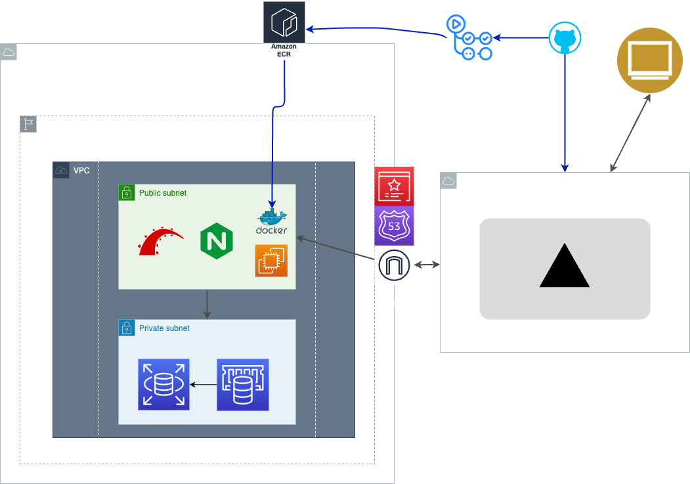

# safety_kayak_fishing

## オリジナルプロダクトの URL

[セーフティカヤックフィッシングアプリ](https://safety-kayak.com)

## 概要

> カヤックフィッシングの事故率上昇に対処し、禁止になることを防ぐため、「海にも登山届のような出船届を！」

```bash
「海上での、万が一に備える」 をしたい
「SUP,カヤックフィッシングをする方」 向けの
「プロダクト名:セーフティカヤックフィッシング」 は
「SUP,カヤックフッシング用のサポートアプリ」 です。

これは 「帰還設定時刻を設定する」 ことができ、
「windyの風予報やタイドグラフアプリなど」 とは違って、
「予報だけでなく、設定時間に帰還できなかった際に身内にメールが飛ぶ機能」
がある。

```

## GitHub リポジトリ

### ドキュメント

[https://github.com/ragna1123/safety_kayak_fishing_documents]

### フロントエンドリポジトリ

[https://github.com/ragna1123/safety-kayak-fishing-frontend]

### バックエンドリポジトリ

[https://github.com/ragna1123/safety-kayak-fishing-backend]

### 画面キャプチャ

## 使用技術

<details>
<summary>使用技術一覧</summary>

## フロントエンド

### フレームワーク

- Next.js

### ライブラリ

#### 型定義

- TypeScript

#### 状態管理

- Recoil

#### フェッチング、キャッシュ関係

- Axios
- ~~RWS~~

#### CSS,UI 関係

- TailwindCSS
- Daisy UI
- Hero Icons

### テスト関係

- ~~Jest~~

## バックエンド

### フレームワーク

- Ruby on Rails(API モード)

### ライブラリ

- ~~ActionMailer(メール送信)~~
- JWT(認証)
- sidekiq
  (時刻で処理を起動させる非同期処理ライブラリ※今回はメール送信,LINE アラート機能に使用)

#### テスト

- Rspec
- factoryBot

## データベース

#### RDB

- Postglesql

#### NoSQL

- Redis(sidekiq に使用)

## 外部 API

### 地図

- GoogleMap(地図) https://developers.google.com/maps?hl=ja

### 天気予報,潮位関係

- StormGlassIO(海況情報、天気を提供する API)
- Visualcrossing(週間天気予報を提供する APU)
- SunriseSunsetAPI(日の出、日の入りを手供する API)
</details>

## ER 図


## インフラ構成図



## 機能一覧(非実装機能は打ち消し線で表示)

### 1. ユーザー管理

- ユーザー登録・ログイン機能。
- プロフィール情報の登録・編集。

### 2. マップと地点管理

- マップ上に出船地点のピンを打つ機能。
- ~~ユーザー個別のマイポイント（秘密の釣り場）の登録・管理。~~
- 地点ごとの詳細情報閲覧（潮位、天気、風、波など）。

### 3. 天気予報と海上情報

- 各地点での天気予報情報の取得と表示。
- 風速、風向きの情報表示。
- 波の高さと周期の情報表示。
- 潮位情報の表示。

### 4. 出船予報と計画管理

- 出船予定の作成、編集、削除機能。
- ~~出船に適した条件を基にした安全スコアの算出。~~
- ~~危険な条件下での出船時に警告を発する機能。~~
- 予定された出船と帰還時間の管理。

### 5. 出船中の監視

- ~~出船中に危険度が上がった場合に知らせる機能~~
- ~~出船中に定期的に海況を知らせる機能~~

### 6. 出船履歴から気象データを提供

- ~~過去の出船した気象データの提供。~~
- ~~当時状況から自身の出船判断へ役立てる機能。~~

### 7. 安全意識向上と啓発

- ~~安全航行に関する情報の提供。~~
- ~~海上での事故防止に役立つ情報の発信。~~
- ~~事故発生時の対処法や連絡先情報の提供。~~

### 8. 緊急連絡機能

- 緊急連絡先を登録、削除する機能
- ~~設定した帰還時間を過ぎた場合に、緊急連絡先へ自動通知する機能。~~
- ~~海上保安庁や最寄りの港の連絡先情報をアプリ内で提供。~~

### 9. フィードバックとコミュニティ機能（検討項目）

- ~~ユーザーからのフィードバック収集機能。~~
- ~~安全に関する知見や経験を共有するコミュニティスペース。~~
