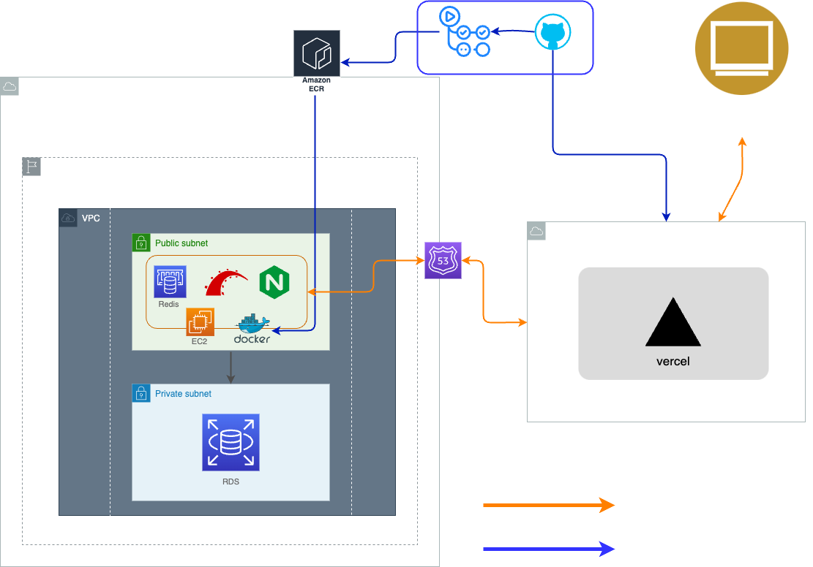

# safety_kayak_fishing

## オリジナルプロダクトの URL

[]

## 概要

> カヤックフィッシングの事故率上昇に対処し、禁止になることを防ぐため、「海にも登山届のような出船届を！」

```bash
「海上での、万が一に備える」 をしたい
「SUP,カヤックフィッシングをする方」 向けの
「プロダクト名:セーフティカヤックフィッシング」 は
「SUP,カヤックフッシング用のサポートアプリ」 です。

これは 「帰還設定時刻を設定する」 ことができ、
「windyの風予報やタイドグラフアプリなど」 とは違って、
「予報だけでなく、設定時間に帰還できなかった際に身内にメールが飛ぶ機能」
がある。

```

## GitHub リポジトリ

### ドキュメント

[https://github.com/ragna1123/safety_kayak_fishing_documents]

### フロント

[https://github.com/ragna1123/safety-kayak-fishing-frontend]

### バック

[https://github.com/ragna1123/safety-kayak-fishing-backend]

### 画面キャプチャ

## 使用技術

<details>
<summary>使用技術一覧</summary>

## フロントエンド

### フレームワーク

- Next.js

### ライブラリ

#### 型定義

- TypeScript

#### 状態管理

- Recoil

#### フェッチング、キャッシュ関係

- Axios
- ~~RWS~~

#### CSS,UI 関係

- TailwindCSS
- Daisy UI
- Hero Icons

### テスト関係

- ~~Jest~~

## バックエンド

### フレームワーク

- Ruby on Rails(API モード)

### ライブラリ

- ActionMailer(メール送信)
- JWT(認証)
- sidekiq
  (時刻で処理を起動させる非同期処理ライブラリ※今回はメール送信,LINE アラート機能に使用)

#### テスト

- Rspec
- factoryBot

## データベース

#### RDB

- Postglesql

#### NoSQL

- Redis(sidekiq に使用)

## 外部 API

### 地図

- GoogleMap(地図) https://developers.google.com/maps?hl=ja

### 天気予報,潮位関係

- StormGlassIO(海況情報、天気を提供する API)
- Visualcrossing(週間天気予報を提供する APU)
- SunriseSunsetAPI(日の出、日の入りを手供する API)
</details>

## ER 図


## インフラ構成図



## 機能一覧
