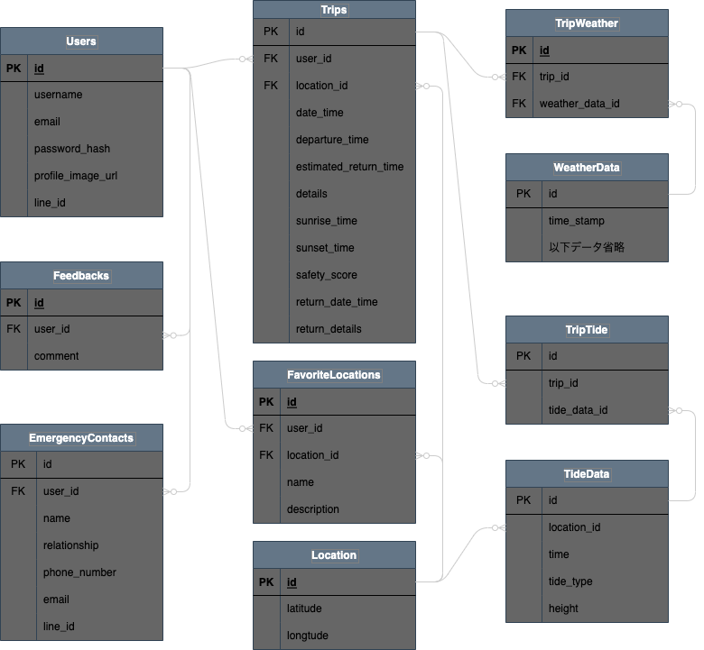

# テーブル定義

## Users (ユーザー情報)

| Field             | Type         | Description         | Constraints          |
|-------------------|--------------|---------------------|----------------------|
| `user_id`         | INT          | ユーザーの一意識別子 | PK, AI, UQ           |
| `username`        | VARCHAR(255) | ユーザー名           | NN                   |
| `email`           | VARCHAR(255) | メールアドレス       | UQ, NN               |
| `password_hash`   | VARCHAR(255) | パスワードのハッシュ値 | NN                 |
| `profile_image_url` | VARCHAR(255) | プロフィール画像のURL | NULL許容           |

---

## Locations (地点)

| Field            | Type          | Description       | Constraints          |
|------------------|---------------|-------------------|----------------------|
| `location_id`    | INT           | 地点の一意識別子   | PK, AI, UQ           |
| `latitude`       | DECIMAL(10, 8)| 緯度               | NN                   |
| `longitude`      | DECIMAL(11, 8)| 経度               | NN                   |

## FavoriteLocations (お気に入り地点)

| Field          | Type        | Description            | Constraints            |
|----------------|-------------|------------------------|------------------------|
| `favorite_id`  | INT         | お気に入りの一意識別子  | PK, AI, UQ             |
| `user_id`      | INT         | ユーザーの一意識別子    | FK                     |
| `location_id`  | INT         | 地点の一意識別子        | FK                     |
| `name`           | VARCHAR(255)  | 地点の名称         | NN                   |
| `description`    | TEXT          | 地点の説明         | NULL許容            |

## Trips (出船スケジュール)

| Field            | Type          | Description       | Constraints          |
|------------------|---------------|-------------------|----------------------|
| `trip_id`        | INT           | 出船予定の一意識別子 | PK, AI, UQ          |
| `user_id`        | INT           | ユーザーのID       | FK                   |
| `location_id`    | INT           | 地点のID           | FK                   |
| `departure_time`      | DATETIME | 出発時刻           | NN                   |
| `estimated_return_time` | DATETIME | 予定帰投時刻      | NN                   |
| `details`        | TEXT          | 予定の詳細情報      | NULL許容            |
| `safety_score`   | INT           | 安全スコア         | NN                   |
| `sunrise_time`       | DATETIME         | 日の出時刻               | NULL許容               |
| `sunset_time`       | DATETIME         | 日の入り時刻               | NULL許容               |

## TripReturn (帰投情報)

| Field            | Type        | Description               | Constraints            |
|------------------|-------------|---------------------------|------------------------|
| `return_id`      | INT         | 帰投情報の一意識別子       | PK, AI, UQ             |
| `trip_id`        | INT         | 関連する出船予定の一意識別子 | FK                     |
| `return_time`    | DATETIME    | 帰投時刻                   |                        |
| `return_details` | TEXT        | 帰投に関する詳細情報       | NULL許容               |

## EmergencyContacts (緊急連絡先情報)

| Field            | Type          | Description       | Constraints          |
|------------------|---------------|-------------------|----------------------|
| `contact_id`     | INT           | 緊急連絡先の一意識別子 | PK, AI, UQ         |
| `user_id`        | INT           | ユーザーのID       | FK                   |
| `name`           | VARCHAR(255)  | 緊急連絡先の名前   | NN                   |
| `relationship`   | VARCHAR(255)  | 関係               | NN                   |
| `phone_number`   | VARCHAR(20)   | 電話番号           | NULL許容            |
| `email`          | VARCHAR(255)  | メールアドレス     | NULL許容, UQ        |
| `line_id`        | VARCHAR(255)  | ラインのID         | NULL許容, 検討中    |

---

<!-- ## ForecastData (気象予報データ)

| Field                | Type          | Description                     | Constraints            |
|----------------------|---------------|---------------------------------|------------------------|
| `forecast_data_id`   | INT           | 気象予報データの一意識別子       | PK, AI, UQ             |
| `forecast_time`      | DATETIME      | 予報対象の日時                   | NN                     |
| `temperature`        | FLOAT         | 予測される気温（°C）            |                        |
| `wind_speed`         | FLOAT         | 予測される風速（m/s）           |                        |
| `wind_direction`     | VARCHAR(255)  | 予測される風向                   |                        |
| `wave_height`        | FLOAT         | 予測される波の高さ（m）         |                        |
| `weather_condition`  | VARCHAR(255)  | 予測される天気の状態            |                        |
| `tide`               | VARCHAR(255)  | 予測される潮の状態              |                        |
| `tide_level`         | FLOAT         | 予測される潮位（m）             | NULL許容               |

## TripForecast (トリップと気象予報の関連)

| Field                | Type          | Description                     | Constraints            |
|----------------------|---------------|---------------------------------|------------------------|
| `trip_forecast_id`   | INT           | トリップと気象予報の関連ID      | PK, AI, UQ             |
| `trip_id`            | INT           | トリップの一意識別子            | FK                     |
| `forecast_data_id`   | INT           | 気象予報データの一意識別子      | FK                     | -->

## WeatherData (気象データ)

| Field              | Type          | Description             | Constraints            |
|--------------------|---------------|-------------------------|------------------------|
| `weather_data_id`  | INT           | 天気データの一意識別子   | PK, AI, UQ             |
| `weather_condition`| VARCHAR(255)  | 天気の状態              |                        |
| `trip_id`          | INT           | 出船予定の一意識別子     | FK, NULL許容           |
| `timestamp`        | DATETIME      | 観測日時                 | NN                     |
| `temperature`      | FLOAT         | 気温（°C）              |                        |
| `wind_speed`       | FLOAT         | 風速（m/s）             |                        |
| `wind_direction`   | VARCHAR(255)  | 風向                   |                        |
| `wave_height`      | FLOAT         | 波の高さ（m）           |                        |
| `tide`             | VARCHAR(255)  | 潮の状態                |                        |
| `tide_level`       | FLOAT         | 潮位（m）               | NULL許容               |

## TripWeather (トリップと気象予報の関連)

| Field                | Type          | Description                     | Constraints            |
|----------------------|---------------|---------------------------------|------------------------|
| `trip_weather_id`   | INT           | トリップと気象の関連ID      | PK, AI, UQ             |
| `trip_id`            | INT           | トリップの一意識別子            | FK                     |
| `weather_data_id`   | INT           | 気象データの一意識別子      | FK                     |

---

## Feedbacks (フィードバック)

| Field            | Type          | Description       | Constraints          |
|------------------|---------------|-------------------|----------------------|
| `feedback_id`    | INT           | フィードバックの一意識別子 | PK, AI, UQ       |
| `title`          | TEXT          | お問い合わせ件名         | NN               |
| `comment`        | TEXT          | コメント           | NN                   |
| `user_id`        | INT           | ユーザーのID       | FK                   |

