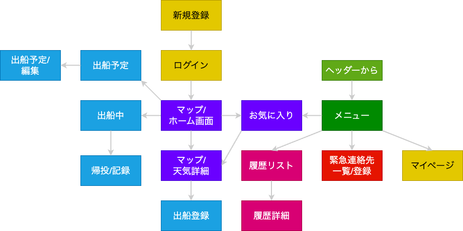

# 必要な画面一覧

#### 1. ユーザー登録画面
- 新規ユーザーがアカウントを作成できる画面。
- 必要な要素: ユーザー名、メールアドレス、パスワード入力フィールド。

#### 2. ログイン画面
- ユーザーがアプリにログインするための画面。
- 必要な要素: メールアドレスとパスワード入力フィールド、ログインボタン。

---
## 左にマップ　右に各コンソールを表示する

#### 3. メイン/マップ画面
- アプリのメインとなる画面。
- 必要な要素: 出船予定の一覧、天気予報へのリンク、履歴確認へのリンク。

#### 4. コンソール/お気に入り一覧
- お気に入り一覧画面。
- 必要な要素: お気に入り一覧(地点名、説明、週間天気情報。)

#### 5. コンソール/天気情報画面
- 選択した地点または予定に関連する天気情報の詳細を表示する画面。
- 必要な要素: 気温、風速・風向、波の高さ、潮の状態表示。

#### 6. コンソール/出船予定作成・編集画面
- 出船予定を作成・編集する画面。
- 必要な要素: 日時、地点選択、詳細情報入力フィールド。

---
#### 7. 出船履歴画面
- 過去の出船履歴を表示する画面。
- 必要な要素: 各出船予定と関連する天気データの詳細表示。

#### 8. 緊急連絡先管理画面
- 緊急連絡先を管理する画面。
- 必要な要素: 連絡先の名前、関係、電話番号、メールアドレス、入力フィールド。

#### 9. フィードバック送信画面
- フィードバックを送信する画面。
- 必要な要素: テキスト入力エリア、送信ボタン。  

